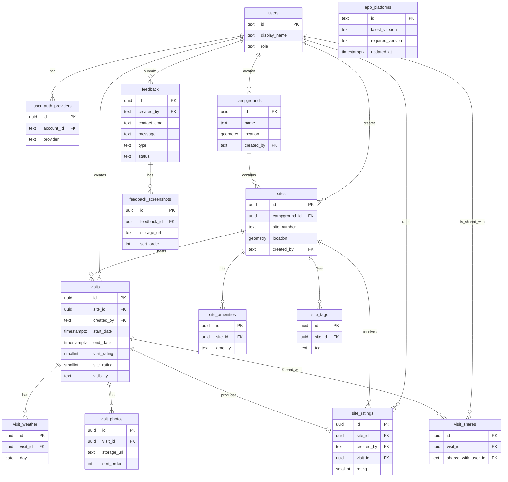

# Postgres schema

Camp Notes stores application data in Neon Postgres with PostGIS for campground and site locations. Parent: [firestore-to-neon-railway.md](./firestore-to-neon-railway.md).

## Conventions

- Primary keys are phone-minted UUIDs, except `users.id`, which is the Firebase uid (`text`).
- Every mutable synced row has `created_at`, `updated_at`, and `deleted_at` (`timestamptz`; `deleted_at` null until soft-deleted).
- Conflict rule: the phone proposes `updated_at`; the server accepts the write only if that timestamp is newer than the stored value (last-write-wins).
- Foreign keys use `ON DELETE RESTRICT`.
- Relationship names in the diagram are roles (how entities relate), not join-column names.
- **Synced tables:** `users`, `user_auth_providers`, `campgrounds`, `sites`, `site_amenities`, `site_tags`, `visits`, `visit_weather`, `visit_photos`, `visit_shares`, `site_ratings`, `feedback`, `feedback_screenshots`.
- **Config:** `app_platforms` (not synced; no `deleted_at`).
- **Views (not tables, not synced):** `site_stats`, `campground_stats`, `personal_site_stats`, `personal_campground_stats`.

## Relationships

## Tables

### `users`

Account profile keyed by Firebase uid.

| Column | Type | Notes |
| --- | --- | --- |
| `id` | `text` PK | Firebase uid |
| `display_name` | `text` null | |
| `role` | `text` not null default `'user'` | `'user'` or `'admin'` |
| `created_at` | `timestamptz` not null | |
| `updated_at` | `timestamptz` not null | |
| `deleted_at` | `timestamptz` null | |

### `user_auth_providers`

Linked sign-in methods for an account.

| Column | Type | Notes |
| --- | --- | --- |
| `id` | `uuid` PK | Phone-minted |
| `account_id` | `text` not null | FK → `users.id` |
| `provider` | `text` not null | `email` or `apple`; unique with `account_id` where not deleted |
| `created_at` | `timestamptz` not null | |
| `updated_at` | `timestamptz` not null | |
| `deleted_at` | `timestamptz` null | |

### `campgrounds`

Campground places.

| Column | Type | Notes |
| --- | --- | --- |
| `id` | `uuid` PK | Phone-minted |
| `name` | `text` not null | |
| `location` | PostGIS point not null | |
| `created_by` | `text` not null | FK → `users.id` |
| `created_at` | `timestamptz` not null | |
| `updated_at` | `timestamptz` not null | |
| `deleted_at` | `timestamptz` null | |

### `sites`

Individual sites within a campground.

| Column | Type | Notes |
| --- | --- | --- |
| `id` | `uuid` PK | Phone-minted |
| `campground_id` | `uuid` not null | FK → `campgrounds.id` |
| `site_number` | `text` not null | |
| `location` | PostGIS point null | |
| `created_by` | `text` not null | FK → `users.id` |
| `created_at` | `timestamptz` not null | |
| `updated_at` | `timestamptz` not null | |
| `deleted_at` | `timestamptz` null | |

### `site_amenities`

Amenities attached to a site.

| Column | Type | Notes |
| --- | --- | --- |
| `id` | `uuid` PK | Phone-minted |
| `site_id` | `uuid` not null | FK → `sites.id` |
| `amenity` | `text` not null | `firering`, `picnicTable`, `shower`, `restroom`, `waterHookup`, `electricalHookup`, `potableWater`, `wifi`; unique with `site_id` where not deleted |
| `created_at` | `timestamptz` not null | |
| `updated_at` | `timestamptz` not null | |
| `deleted_at` | `timestamptz` null | |

### `site_tags`

Free-form tags on a site.

| Column | Type | Notes |
| --- | --- | --- |
| `id` | `uuid` PK | Phone-minted |
| `site_id` | `uuid` not null | FK → `sites.id` |
| `tag` | `text` not null | Unique with `site_id` where not deleted |
| `created_at` | `timestamptz` not null | |
| `updated_at` | `timestamptz` not null | |
| `deleted_at` | `timestamptz` null | |

### `visits`

A user's stay at a site.

| Column | Type | Notes |
| --- | --- | --- |
| `id` | `uuid` PK | Phone-minted |
| `site_id` | `uuid` not null | FK → `sites.id` |
| `created_by` | `text` not null | FK → `users.id` |
| `start_date` | `timestamptz` not null | |
| `end_date` | `timestamptz` not null | |
| `visit_rating` | `smallint` not null | 1–5 |
| `site_rating` | `smallint` not null | 1–5 |
| `notes` | `text` null | |
| `visibility` | `text` not null default `'private'` | `private`, `public`, or `shared` |
| `created_at` | `timestamptz` not null | |
| `updated_at` | `timestamptz` not null | |
| `deleted_at` | `timestamptz` null | |

### `visit_weather`

Weather for one calendar day of a visit.

| Column | Type | Notes |
| --- | --- | --- |
| `id` | `uuid` PK | Phone-minted |
| `visit_id` | `uuid` not null | FK → `visits.id` |
| `day` | `date` not null | Unique with `visit_id` where not deleted |
| `temp_high` | `double precision` null | |
| `temp_low` | `double precision` null | |
| `temp_unit` | `text` null | `F` or `C` |
| `conditions` | `text` null | |
| `precipitation` | `double precision` null | |
| `wind_speed` | `double precision` null | |
| `humidity` | `double precision` null | |
| `created_at` | `timestamptz` not null | |
| `updated_at` | `timestamptz` not null | |
| `deleted_at` | `timestamptz` null | |

### `visit_photos`

Photo metadata for a visit (file in Storage; URL here).

| Column | Type | Notes |
| --- | --- | --- |
| `id` | `uuid` PK | Phone-minted |
| `visit_id` | `uuid` not null | FK → `visits.id` |
| `storage_url` | `text` not null | |
| `sort_order` | `integer` not null default 0 | |
| `created_at` | `timestamptz` not null | |
| `updated_at` | `timestamptz` not null | |
| `deleted_at` | `timestamptz` null | |

### `visit_shares`

Users a visit is shared with when visibility is `shared`.

| Column | Type | Notes |
| --- | --- | --- |
| `id` | `uuid` PK | Phone-minted |
| `visit_id` | `uuid` not null | FK → `visits.id` |
| `shared_with_user_id` | `text` not null | FK → `users.id`; unique with `visit_id` where not deleted |
| `created_at` | `timestamptz` not null | |
| `updated_at` | `timestamptz` not null | |
| `deleted_at` | `timestamptz` null | |

### `site_ratings`

Per-user site rating, optionally tied to a visit.

| Column | Type | Notes |
| --- | --- | --- |
| `id` | `uuid` PK | Phone-minted |
| `site_id` | `uuid` not null | FK → `sites.id` |
| `created_by` | `text` not null | FK → `users.id` |
| `visit_id` | `uuid` null | FK → `visits.id` |
| `rating` | `smallint` not null | 1–5 |
| `created_at` | `timestamptz` not null | |
| `updated_at` | `timestamptz` not null | |
| `deleted_at` | `timestamptz` null | |

### `feedback`

In-app feedback submissions.

| Column | Type | Notes |
| --- | --- | --- |
| `id` | `uuid` PK | Phone-minted |
| `created_by` | `text` not null | FK → `users.id` |
| `contact_email` | `text` null | Optional follow-up contact |
| `message` | `text` not null | |
| `type` | `text` not null | `bug`, `featureRequest`, or `general` |
| `device` | `text` not null | |
| `os_version` | `text` not null | |
| `app_version` | `text` not null | |
| `status` | `text` not null default `'new'` | `new`, `inProgress`, `closed`, or `logged` |
| `github_link` | `text` null | |
| `created_at` | `timestamptz` not null | |
| `updated_at` | `timestamptz` not null | |
| `deleted_at` | `timestamptz` null | |

### `feedback_screenshots`

Screenshot metadata for feedback (file in Storage; URL here).

| Column | Type | Notes |
| --- | --- | --- |
| `id` | `uuid` PK | Phone-minted |
| `feedback_id` | `uuid` not null | FK → `feedback.id` |
| `storage_url` | `text` not null | |
| `sort_order` | `integer` not null default 0 | |
| `created_at` | `timestamptz` not null | |
| `updated_at` | `timestamptz` not null | |
| `deleted_at` | `timestamptz` null | |

### `app_platforms`

Version gating config. Not synced.

| Column | Type | Notes |
| --- | --- | --- |
| `id` | `text` PK | e.g. `ios` |
| `latest_version` | `text` not null | |
| `required_version` | `text` not null | Minimum allowed app version |
| `updated_at` | `timestamptz` not null | |

## Views

Computed from `site_ratings` and `visits`. Not tables. Not synced.

| View | Derives |
| --- | --- |
| `site_stats` | Per-site rating and visit aggregates from `site_ratings` and `visits` |
| `campground_stats` | Per-campground aggregates rolled up from site-level ratings and visits |
| `personal_site_stats` | Per-user, per-site aggregates from that user's `site_ratings` and `visits` |
| `personal_campground_stats` | Per-user, per-campground aggregates from that user's `site_ratings` and `visits` |

## Access

The server verifies the Firebase ID token and sets database user context. Postgres row rules:

- `users`, `user_auth_providers`: owner of own row; admin all
- `visits`, `visit_weather`, `visit_photos`, `visit_shares`, `feedback`, `feedback_screenshots`, `site_ratings`: owning user (via `created_by` or visit owner); shared visits readable by `visit_shares`; admin all
- `campgrounds`, `sites`, `site_amenities`, `site_tags`: authenticated read; create as authenticated; update/delete owner or admin
- `app_platforms`: authenticated read; admin write
- Stats views: same visibility as the underlying ratings and visits
