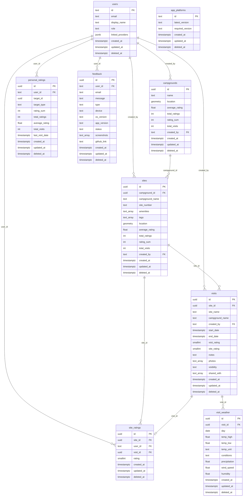

# Postgres schema

Relational schema for Camp Notes on Neon. Shapes follow [`campnotes-ios/docs/datamodel.md`](https://github.com/Camp-Notes/campnotes-ios/blob/main/docs/datamodel.md) and `AppPackage/Sources/Models`.

Parent: [firestore-to-neon-railway.md](./firestore-to-neon-railway.md)

PostGIS is enabled. Campground and site locations are PostGIS points.

Every synced table includes:

- `id` — primary key; phone-minted UUID unless noted
- `created_at` — `timestamptz`
- `updated_at` — `timestamptz`; phone proposes, server accepts only if newer than stored
- `deleted_at` — `timestamptz` null; soft-delete tombstone

Foreign keys use `ON DELETE RESTRICT` so soft-deleted rows stay coherent.

## Entity relationships

`personal_ratings` targets either a site or a campground via `target_type` (`site` | `campground`) plus `target_id`. That cannot be a single foreign key; enforce with `target_type` and application / row-rule checks. Unique on (`user_id`, `target_type`, `target_id`) where `deleted_at` is null.

`sites.campground_name`, `visits.site_name`, and `visits.campground_name` are denormalized for offline and UI; the foreign key is authoritative when present.

`visits.shared_with` is a `text[]` of user ids, not a join table.

`app_platforms` has no foreign key to `users`.

## Tables

### `users`

| Column | Type | Notes |
| --- | --- | --- |
| `id` | `text` PK | Firebase uid |
| `email` | `text` null | |
| `display_name` | `text` null | |
| `role` | `text` not null default `'user'` | `'admin'` for admins |
| `linked_providers` | `jsonb` not null default `'[]'` | e.g. email, apple |
| `created_at` | `timestamptz` not null | |
| `updated_at` | `timestamptz` not null | |
| `deleted_at` | `timestamptz` null | |

### `campgrounds`

| Column | Type | Notes |
| --- | --- | --- |
| `id` | `uuid` PK | Phone-minted |
| `name` | `text` not null | |
| `location` | PostGIS point not null | |
| `average_rating` | `double precision` not null default 0 | Derived |
| `total_ratings` | `integer` not null default 0 | |
| `rating_sum` | `integer` not null default 0 | |
| `total_visits` | `integer` not null default 0 | |
| `created_by` | `text` not null | FK → `users.id` |
| `created_at` | `timestamptz` not null | |
| `updated_at` | `timestamptz` not null | |
| `deleted_at` | `timestamptz` null | |

### `sites`

| Column | Type | Notes |
| --- | --- | --- |
| `id` | `uuid` PK | Phone-minted |
| `campground_id` | `uuid` not null | FK → `campgrounds.id` |
| `campground_name` | `text` not null | Denormalized |
| `site_number` | `text` not null | |
| `amenities` | `text[]` not null default `'{}'` | firering, picnicTable, shower, restroom, waterHookup, electricalHookup, potableWater, wifi |
| `tags` | `text[]` not null default `'{}'` | |
| `location` | PostGIS point null | |
| `average_rating` | `double precision` not null default 0 | Derived from `site_ratings` |
| `total_ratings` | `integer` not null default 0 | |
| `rating_sum` | `integer` not null default 0 | |
| `total_visits` | `integer` not null default 0 | |
| `created_by` | `text` not null | FK → `users.id` |
| `created_at` | `timestamptz` not null | |
| `updated_at` | `timestamptz` not null | |
| `deleted_at` | `timestamptz` null | |

### `visits`

| Column | Type | Notes |
| --- | --- | --- |
| `id` | `uuid` PK | Phone-minted |
| `site_id` | `uuid` null | FK → `sites.id` |
| `site_name` | `text` null | Denormalized |
| `campground_name` | `text` null | Denormalized |
| `created_by` | `text` not null | FK → `users.id` |
| `start_date` | `timestamptz` not null | |
| `end_date` | `timestamptz` not null | |
| `visit_rating` | `smallint` not null | 1–5 |
| `site_rating` | `smallint` not null | 1–5 |
| `notes` | `text` null | |
| `photos` | `text[]` not null default `'{}'` | Firebase Storage URLs |
| `visibility` | `text` not null default `'private'` | private / public / shared |
| `shared_with` | `text[]` not null default `'{}'` | |
| `created_at` | `timestamptz` not null | |
| `updated_at` | `timestamptz` not null | |
| `deleted_at` | `timestamptz` null | |

Weather is not stored on the visit row. See `visit_weather`.

### `visit_weather`

One row per day of weather attached to a visit (replaces the former weather array on the visit document).

| Column | Type | Notes |
| --- | --- | --- |
| `id` | `uuid` PK | Phone-minted |
| `visit_id` | `uuid` not null | FK → `visits.id` |
| `day` | `date` not null | Calendar day for this observation |
| `temp_high` | `double precision` null | |
| `temp_low` | `double precision` null | |
| `temp_unit` | `text` null | `F` or `C` |
| `conditions` | `text` null | e.g. Sunny, Rainy, Cloudy |
| `precipitation` | `double precision` null | |
| `wind_speed` | `double precision` null | |
| `humidity` | `double precision` null | Percentage |
| `created_at` | `timestamptz` not null | |
| `updated_at` | `timestamptz` not null | |
| `deleted_at` | `timestamptz` null | |

Unique on (`visit_id`, `day`) where `deleted_at` is null.

### `site_ratings`

| Column | Type | Notes |
| --- | --- | --- |
| `id` | `uuid` PK | Phone-minted |
| `site_id` | `uuid` not null | FK → `sites.id` |
| `user_id` | `text` not null | FK → `users.id` |
| `visit_id` | `uuid` null | FK → `visits.id` |
| `rating` | `smallint` not null | 1–5 |
| `created_at` | `timestamptz` not null | |
| `updated_at` | `timestamptz` not null | |
| `deleted_at` | `timestamptz` null | |

### `personal_ratings`

| Column | Type | Notes |
| --- | --- | --- |
| `id` | `uuid` PK | Phone-minted |
| `user_id` | `text` not null | FK → `users.id` |
| `target_id` | `uuid` not null | Site or campground id |
| `target_type` | `text` not null | `site` or `campground` |
| `rating_sum` | `integer` not null default 0 | |
| `total_ratings` | `integer` not null default 0 | |
| `average_rating` | `double precision` not null default 0 | |
| `total_visits` | `integer` not null default 0 | |
| `last_visit_date` | `timestamptz` null | |
| `created_at` | `timestamptz` not null | |
| `updated_at` | `timestamptz` not null | |
| `deleted_at` | `timestamptz` null | |

Unique on (`user_id`, `target_type`, `target_id`) where `deleted_at` is null.

### `feedback`

| Column | Type | Notes |
| --- | --- | --- |
| `id` | `uuid` PK | Phone-minted |
| `user_id` | `text` not null | FK → `users.id` |
| `email` | `text` null | |
| `message` | `text` not null | |
| `type` | `text` not null | bug / featureRequest / general |
| `device` | `text` not null | |
| `os_version` | `text` not null | |
| `app_version` | `text` not null | |
| `status` | `text` not null default `'new'` | new / inProgress / closed / logged |
| `screenshots` | `text[]` not null default `'{}'` | Storage URLs |
| `github_link` | `text` null | |
| `created_at` | `timestamptz` not null | |
| `updated_at` | `timestamptz` not null | |
| `deleted_at` | `timestamptz` null | |

### `app_platforms`

Version gating per platform.

| Column | Type | Notes |
| --- | --- | --- |
| `id` | `text` PK | e.g. `ios` |
| `latest_version` | `text` not null | |
| `required_version` | `text` not null | Minimum allowed app version |
| `created_at` | `timestamptz` not null | |
| `updated_at` | `timestamptz` not null | |
| `deleted_at` | `timestamptz` null | |

## Authorization

The server verifies the Firebase ID token and sets database user context. Postgres row rules enforce access:

- `users`: owner of own row; admin all
- `visits`, `visit_weather`, `feedback`, `personal_ratings`, `site_ratings`: owning user (via visit owner or direct user id); admin all
- `campgrounds`, `sites`: authenticated read; create as authenticated; update/delete owner or admin
- `app_platforms`: authenticated read; admin write
